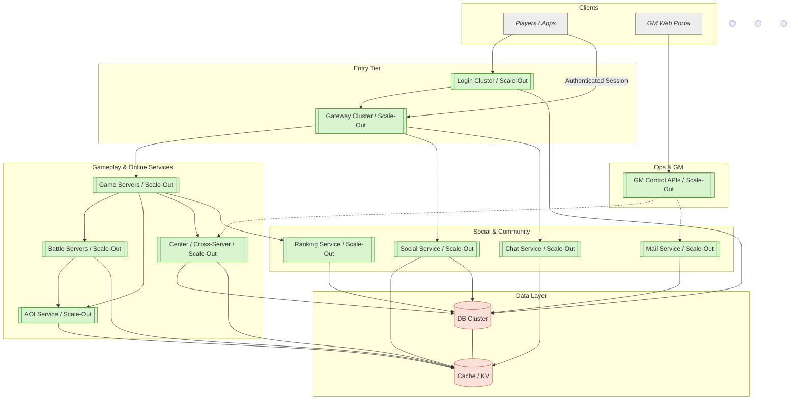

# 服务架构概览

下图是当前 SLG 后端的高层拓扑，涵盖登录、游戏、战斗、社交、聊天、排行、AOI、跨服、GM 等服务以及底层数据库/缓存。绿色节点表示可以水平扩展的无状态服务，橙色节点表示需要有状态部署的存储层组件，灰色节点为外部入口。

## 说明

- 客户端首先访问 Login 服务获取账号认证和 Gateway 分配；Login 将令牌和路由信息下发给客户端，客户端携带认证连接 Gateway，Gateway 再将业务流量转发到 Game、Social、Chat 等无状态集群。
- Game 与 Battle 负责实时战斗、仿真等逻辑，AOI 服务维护可见性/兴趣区域，Center 服务承载跨服活动逻辑。
- 社交相关模块（Social/Chat/Mail/Ranking）与游戏主服解耦，读写共享的缓存和数据库。
- GM Web Portal 通过 GMService 间接调用 Center/Mail 等后台接口，实现公告、补偿、实时查询等运营功能。
- 底层数据层由分布式数据库与缓存组成，所有在线服务共享访问通道，必要时可通过读写分离、分片、冷热分层进一步扩展。
